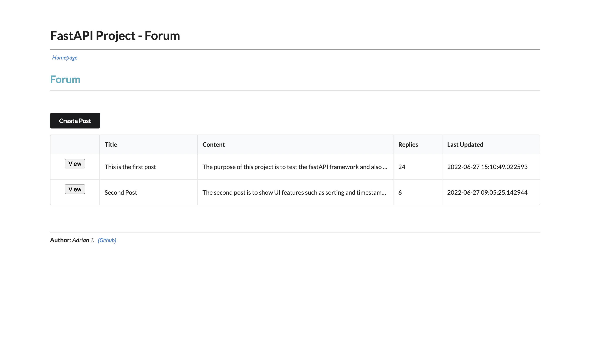
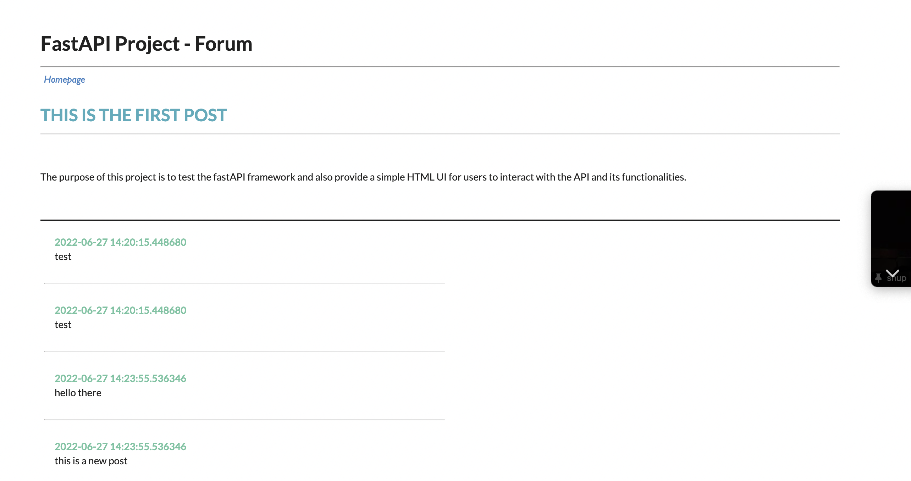

# FASTAPI FORUM APP


## Author

-   [@adriant19](https://github.com/adriant19)

## Table of contents

-   [Objective](#objective)
-   [Methodology and framework](#methodology-and-framework)
-   [Preview](#preview)
-   [Learnings and recommendation](#learnings-and-recommendation)
-   [Limitations and potential improvements](#limitations-and-potential-improvements)
-   [Repository structure](#repository-structure)
-   [Final Remarks](#final-remarks)

## Objective

The development of this app served as a learning opportunity to better understand backend services and API functionalities.

## Methodology and framework

-   FastAPI web framework
-   Redis Cloud (database)
-   Jinja2 template engine
-   APIRouter for path operations

## Previews

##### Homepage

> Contains all posts in a table format, containing the main content and tied to them are the corresponding replies that were issued within the view of the post. Replies submitted by users within each post would update the `update_at` field.



##### Viewpage

> Contains the main post selected that have been viewed followed by submitted replies.



## Learnings and potential improvements

-   Redis OM was used to experiment with alternative databasing approaches. The setup of Redis was convenient and the usage of the data objects (`HashModel`) made development quick and easy.
-   For simplicity reasons, the API was developed without user authentication (i.e. with JWT tokenisation). Further development with user base features could be introduced.
-   Issues with the datetime capture the same "runtime" datetime when performing multiple POST requests to either create posts or replies was not resolved (open to feedback on how to resolve this).
-   **Possible limitation with Heroku**: the app tends to load quite slowly when performing actions.

## Repository structure

```

├── app                                 < app folder
│       ├── routers                     < submodules folder
│       │       ├── post.py             < post submodule with path operations
│       │       ├── reply.py            < reply submodule with path operations
│       │
│       ├── templates                   < html templates for Jinja2
│       │       ├── homepage.html       < all post layout
│       │       ├── layout.html         < default outer structure of page layout
│       │       ├── viewpage.html       < selected post layout with replies
│       │
│       ├── __init__.py                 < initialize app package
│       ├── config.py                   < reading of environment configurations
│       ├── database.py                 < connection setup to redis-om
│       ├── main.py                     < launching of app
│       ├── schemas.py                  < creation of data objects
│
├── previews                            < images for readme.md
│       ├── homepage.png                < preview of homepage with posts
│       ├── viewpage.png                < preview of selected post and replies
│
├── .gitignore                          < ignore listed folders and files for commits to git.
├── Procfile                            < command to be executed on Heroku app upon start-up
├── README.md                           < readme file
├── requirements.txt                    < list of dependencies by version needed for Heroku app

```

## Final remarks

A barebone HTML frontend UI (no prior experience with HTML) was used to provide simple interactability for users to test the functionalities of the API. Initially, this project was originally hosted on Heroku for viewers to have a "look-and-feel" of the development done. Unfortunately, as of late 2022 the platform has stopped providing free hostings; making the web app inaccessible. Alternatives to explore are Firebase.
